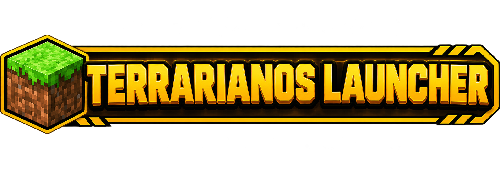

# 🎮 TERRACRAFT LAUNCHER



Launcher personalizado para **Minecraft Java** con gestión integrada de servidores **Purpur** y **Vanilla**, soporte para **crossplay Java ↔ Bedrock** y herramientas de red para compartir tu servidor con amigos.

> Proyecto personal en desarrollo activo. Si encuentras un bug o tienes una sugerencia, únete al Discord.

---

## ✨ Características

### 🎮 Cliente
- Descarga e instalación automática de **cualquier versión de Minecraft Java**.
- Selección de **RAM** asignada (2 GB a 16 GB).
- Detección automática de Java del sistema.
- Inicio del juego sin cerrar el launcher.
- Música de fondo con control de volumen.

### 🖥️ Servidor
- Descarga e instalación automática de servidores:
  - **Purpur** (todas las versiones disponibles desde la API oficial).
  - **Vanilla** (todas las versiones de Mojang).
- Descarga automática de **Java portable** según la versión del servidor (8, 16, 17, 21, 25).
- Carpetas separadas para `purpur/` y `vanilla/` — sin conflictos.
- Botón único dinámico: INSTALAR → ARRANCAR → DETENER.
- Consola integrada para enviar comandos al servidor en tiempo real.
- Detención limpia con `stop` y `taskkill` de árbol de procesos.

### 🎨 Skins
- Añade skins desde **URL directa** (Imgur, Discord, tu propio servidor, etc.).
- Validación automática de formato PNG y dimensiones (64×64 o 64×32).
- **Previsualización 3D** frontal y trasera de cada skin con `skinpy`.
- Navegación con flechas entre tus skins guardadas.
- Botón copiar que pone el comando `/skin url "..."` al portapapeles.

### 🧩 Mods Spigot
- Gestión de plugins `.jar` desde el launcher.
- Añadir plugins **desde archivo** o **desde URL**.
- Activar/desactivar sin reiniciar el servidor (renombra `.jar` ↔ `.jar.disabled`).
- Eliminar plugins con confirmación.

### 🌐 Red
- Consulta automática de tu **IP pública IPv4 e IPv6**.
- Direcciones listas para copiar:
  - Java: `IP:25565`
  - Bedrock: `IP:19132`
- Botón copiar para cada dirección.
- Actualización automática de **Geyser** y **Floodgate** al iniciar.

### 📜 Log
- Consola del servidor en vivo.
- Envío de comandos directamente al servidor.
- Historial con hasta 3000 líneas.

### ℹ️ Info
- Créditos del creador.
- Versión del launcher.
- Listado completo de librerías y dependencias.
- Botones directos a GitHub y Discord.

---

## 📋 Requisitos

- **Windows 10/11** (probado en Windows 10 y 11).
- **Python 3.10+** (el instalador lo instala si no lo tienes).
- **Conexión a Internet** para la primera descarga.
- Espacio en disco: ~2 GB (Java + servidor + Minecraft).

---

## 🚀 Instalación

### 1. Clona o descarga el proyecto

O descarga el ZIP y descomprímelo.

2. Ejecuta el instalador

Doble clic en INSTALAR.bat. El instalador:

    Comprueba si tienes Python. Si no, lo instala automáticamente.

    Instala las dependencias (PySide6, minecraft-launcher-lib, Pillow, skinpy).

    Verifica los archivos en assets/.

    Genera LANZADOR_PYTHON.bat y CREAR_UN_EXE.bat.

3. Arranca el launcher

Doble clic en LANZADOR_PYTHON.bat.

O si prefieres compilar un .exe:
text

CREAR_UN_EXE.bat

El ejecutable aparecerá en TERRALAUNCHER/TERRACRAFT.exe.

📁 Estructura del proyecto
text

TERRACRAFT/
├── INSTALAR.bat              Instalador automático
├── TERRACRAFT.py             Código principal del launcher
├── LANZADOR_PYTHON.bat       (generado) Arranca el launcher
├── CREAR_UN_EXE.bat          (generado) Compila a .exe
├── README.md
├── assets/
│   ├── banner.png            Banner superior
│   ├── discord.png           Icono Discord
│   ├── github.png            Icono GitHub
│   ├── author.png            Tu foto (pestaña Info)
│   ├── fondo.gif             Fondo animado
│   ├── icon.png / icon.ico   Icono del launcher
│   └── music.mp3             Música de fondo
├── config/                   (generado) Ajustes del usuario
│   └── settings.json
├── minecraft/                (generado) Versiones del cliente
├── java/                     (generado) Java portable por versión
│   ├── 17/r/bin/java.exe
│   ├── 21/r/bin/java.exe
│   └── 25/r/bin/java.exe
└── server/
    ├── purpur/               Servidores Purpur
    │   ├── purpur-X.jar
    │   ├── plugins/
    │   └── world/
    └── vanilla/              Servidores Vanilla
        ├── vanilla-X.jar
        └── world/

🎯 Uso
Jugar Minecraft

    Ve a la pestaña 🎮 Cliente.

    Escribe tu nombre de usuario.

    Elige la versión de Minecraft.

    Selecciona la RAM (4 GB recomendado para empezar).

    Pulsa COMENZAR.

Si la versión no está descargada, se descarga automáticamente.
Crear un servidor

    Ve a la pestaña 🖥️ Servidor.

    Selecciona el tipo: Purpur o Vanilla.

    Elige la versión.

    Selecciona la RAM.

    Pulsa INSTALAR SERVIDOR.

El launcher:

    Detecta qué versión de Java necesita.

    La descarga si no está instalada.

    Descarga el servidor.

    Descarga Geyser + Floodgate + SkinsRestorer (si es Purpur).

Cuando termine, el botón cambia a ▶ ARRANCAR SERVIDOR.
Compartir tu servidor

    Ve a la pestaña 🌐 Red.

    Copia tu IP con el botón 📋 de cada fila.

    Comparte la IP con tus amigos:

        Java: tu-ip:25565

        Bedrock: tu-ip puerto 19132

    Importante: abre los puertos en tu router (25565 y 19132).

Con IP IPv6 no necesitas abrir puertos.
Añadir skins personalizadas

    Ve a la pestaña 🎨 Skins de Servidor.

    Sube tu skin a cualquier servicio (Imgur, Discord, tu servidor, etc.).

    Copia el enlace directo a la imagen (debe terminar en .png).

    Pega el enlace en el launcher.

    Pulsa ➕ Añadir.

El launcher valida y previsualiza la skin en 3D.

Luego entra al servidor y escribe:
text

/skin url "https://tu-enlace-directo.png"

Gestionar plugins

    Ve a la pestaña 🧩 Mods Spigot.

    Pulsa 📁 para elegir un .jar o pega una URL.

    El plugin se añade a server/purpur/plugins/.

    Para desactivar: selecciona y pulsa 🔄 Activar/Desactivar.

🔧 Tecnologías
Tecnología	Uso
Python 3.10+	Lenguaje base
PySide6	Interfaz gráfica (Qt6)
minecraft-launcher-lib	Descarga y lanzamiento del cliente
Pillow (PIL)	Procesamiento de imágenes y skins
skinpy	Render 3D de skins
urllib / zipfile / shutil / threading / subprocess	Utilidades estándar
Purpur API	Versiones y descargas de Purpur
Mojang Piston Meta	Versiones y descargas de Vanilla
Adoptium API	Descargas de Java portable
GeyserMC API	Geyser + Floodgate
⚠️ Notas importantes

    Modo offline: el servidor se configura con online-mode=false, así que cualquiera con la IP puede entrar. Si vas a exponer el servidor a Internet, considera añadir autenticación.

    Java 8: los servidores de versiones anteriores a 1.12 no se descargan automáticamente por limitaciones de la API de Adoptium. Solo se cubren 16, 17, 21 y 25.

    SkinsRestorer: para que las URLs funcionen, el dominio debe estar en la whitelist del config.yml del plugin. Por defecto viene con files.catbox.moe añadido.

    Puertos: recuerda abrir el 25565 (Java) y el 19132 (Bedrock) en tu router.

🤝 Contribuir

Si quieres aportar ideas, reportar bugs o proponer mejoras:

    Abre un issue describiendo el problema o sugerencia.

    O haz un fork y envía un pull request con tus cambios.

Cualquier ayuda es bienvenida.
📜 Licencia

Este proyecto está bajo la licencia MIT. Puedes usarlo, modificarlo y distribuirlo libremente. Consulta el archivo LICENSE para más detalles.
💖 Créditos

    Creado por: Sailor_Rei

    Comunidad: Discord del proyecto

    Agradecimientos: a todos los que probaron el launcher y reportaron bugs.

<div align="center">

⭐ Si te gusta el proyecto, dale una estrella en GitHub ⭐

Hecho con 💙 por Sailor_Rei
</div> ```
